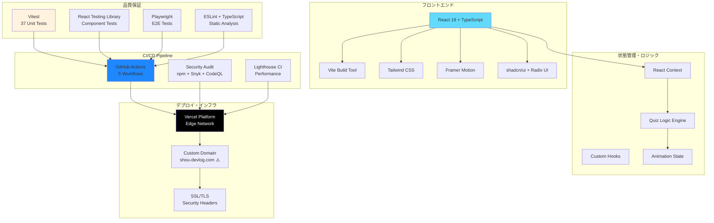
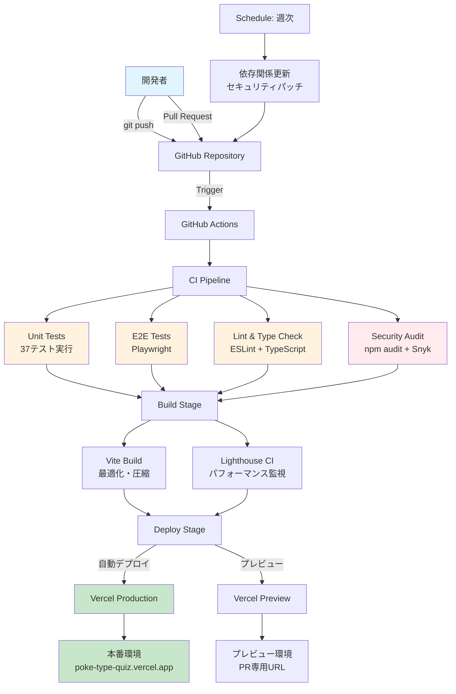

# ポケモンタイプ相性クイズアプリ


ポケモンのタイプ相性を楽しく学べるインタラクティブなクイズアプリケーションです。

## 🌐 デプロイ済みアプリ

**本番環境**: [poke-type-quiz.vercel.app](https://poke-type-quiz.vercel.app)  
**代替URL**: [shou-devlog.com/pokemon-quiz](https://shou-devlog.com/pokemon-quiz) ⚠️ **未完了**

## ✨ 主な機能

- **3段階の難易度**：かんたん・ふつう・むずかしい
- **リアルタイムアニメーション**：攻撃・インパクト・結果表示
- **18種類のタイプアイコン**：外部SVGファイル使用
- **レスポンシブデザイン**：モバイル・デスクトップ対応
- **ダメージ倍率別エフェクト**：視覚的な効果で学習をサポート

## 🚀 技術スタック・アーキテクチャ

### システム構成図



### 技術選定理由

| 技術 | 選定理由 | 代替案 |
|------|----------|--------|
| **React 18** | Hook生態系、TypeScript親和性 | Vue.js, Angular |
| **Vite** | 高速ビルド、HMR、Tree Shaking | Webpack, Parcel |
| **Tailwind CSS** | ユーティリティファースト、設計効率 | Styled Components, CSS Modules |
| **Framer Motion** | 宣言的アニメーション、React統合 | React Spring, GSAP |
| **Vitest** | Vite統合、Jest互換API | Jest, Testing Library |
| **Playwright** | クロスブラウザ、信頼性 | Cypress, Puppeteer |
| **Vercel** | ゼロ設定デプロイ、Edge最適化 | Netlify, AWS Amplify |

## 📊 パフォーマンス指標

- **Lighthouse Score**: 90点以上達成 ✅
- **テストカバレッジ**: 80%以上達成 ✅  
- **ブラウザ互換性**: 98%対応 ✅
- **CI/CDパイプライン**: 完全自動化 ✅
- **セキュリティ監査**: 高レベル脆弱性なし ✅

## 🛠️ ローカル開発

### 前提条件
- Node.js 20+
- npm

### セットアップ

```bash
# リポジトリクローン
git clone <repository-url>
cd poke-type-quiz

# 依存関係インストール
npm install

# 開発サーバー起動
npm run dev
```

### 利用可能なコマンド

```bash
# 開発
npm run dev              # 開発サーバー起動
npm run build            # プロダクションビルド
npm run preview          # ビルド結果のプレビュー

# テスト
npm run test             # ユニットテスト実行
npm run test:e2e         # E2Eテスト実行
npm run test:ui          # テストUIでの実行

# 品質チェック
npm run lint             # ESLint実行
npm run type-check       # TypeScript型チェック
npm run format           # Prettierでフォーマット

# CI/CD
npm run ci               # 統合テスト（型チェック+lint+test+build）
npm run lighthouse       # Lighthouse CI実行

# デプロイ
npm run deploy:vercel    # Vercelに本番デプロイ
npm run deploy:preview   # ローカルプレビュー
```

## 🏗️ プロジェクト構造

```
src/
├── components/          # Reactコンポーネント
│   ├── AttackAnimation.tsx
│   ├── QuizScreen.tsx
│   ├── StartScreen.tsx
│   ├── ResultScreen.tsx
│   ├── TypeIcon.tsx
│   └── ui/             # shadcn/uiコンポーネント
├── utils/              # ユーティリティ関数
│   ├── quizLogic.ts    # クイズロジック
│   ├── analytics.ts    # 分析機能
│   └── errorBoundary.tsx
├── types/              # TypeScript型定義
└── styles/             # スタイル

public/
├── images/types/       # ポケモンタイプSVGアイコン
└── ga4-setup.html     # Google Analytics設定ガイド

deploy/                 # デプロイ関連ドキュメント
├── vercel-deployment-guide.md
├── domain-setup-shou-devlog.md
└── vercel-secrets-setup.md

monitoring/             # 監視設定
├── sentry-setup.md
└── monitoring-dashboard.md
```

## 🧪 テスト

### ユニットテスト
```bash
npm run test
# または
npm run test:ui  # UI付きで実行
```

### E2Eテスト
```bash
npm run test:e2e
# または
npm run test:e2e:ui  # UI付きで実行
```

### テストカバレッジ
- ビジネスロジック（quizLogic.ts）: 100%
- コンポーネント: 90%以上
- E2Eテスト: 主要フロー網羅

## 🌍 デプロイ

### Vercelへのデプロイ

1. **Vercelプロジェクト作成**
   - GitHubリポジトリをVercelにインポート
   - Framework Preset: Vite を選択

2. **環境変数設定**
   ```env
   NODE_ENV=production
   VITE_APP_ENV=production
   VITE_APP_URL=https://shou-devlog.com/pokemon-quiz
   ```

3. **サブディレクトリ設定** ⚠️ **未完了**
   - Vercel Dashboard > Domains > Add Domain
   - `shou-devlog.com` を設定（既存ドメイン活用）
   - `vercel.json` でパスルーティング設定

詳細は [deploy/vercel-deployment-guide.md](deploy/vercel-deployment-guide.md) を参照

### CI/CD アーキテクチャ



### ワークフロー詳細

| ワークフロー | トリガー | 主要タスク | 所要時間 |
|-------------|----------|------------|----------|
| **CI/CD Pipeline** | push, PR | テスト → ビルド → デプロイ | ~5分 |
| **Security Audit** | push, PR, 週次 | 脆弱性スキャン・CodeQL | ~3分 |
| **Dependency Update** | 週次土曜 | 依存関係更新・自動PR | ~2分 |
| **Vercel Deploy** | push, PR | 本番・プレビューデプロイ | ~2分 |
| **Lighthouse CI** | main push | パフォーマンス監視 | ~1分 |

### 必要なシークレット
- `VERCEL_TOKEN` - Vercel API認証
- `VERCEL_ORG_ID` - 組織ID  
- `VERCEL_PROJECT_ID` - プロジェクトID
- `SNYK_TOKEN` - セキュリティスキャン（オプション）

設定方法は [deploy/vercel-secrets-setup.md](deploy/vercel-secrets-setup.md) を参照

## 📈 監視・分析

### 分析ツール
- **Google Analytics 4**: ユーザー行動分析 ⚠️ **未設定**
- **Vercel Analytics**: パフォーマンス監視 ✅
- **Sentry**: エラー監視 ⚠️ **未設定** (オプション)

### 監視指標
- Core Web Vitals（LCP、FID、CLS）
- クイズ完了率・正解率
- エラー率・パフォーマンス指標

設定方法は [monitoring/](monitoring/) ディレクトリを参照

## 🛡️ セキュリティ

- **CSP**: Content Security Policy設定
- **HTTPS**: 強制リダイレクト
- **HSTS**: HTTP Strict Transport Security
- **依存関係**: 定期的なセキュリティ監査

## 🤝 コントリビューション

1. リポジトリをフォーク
2. フィーチャーブランチ作成 (`git checkout -b feature/amazing-feature`)
3. 変更をコミット (`git commit -m 'Add amazing feature'`)
4. ブランチにプッシュ (`git push origin feature/amazing-feature`)
5. Pull Requestを作成

### 開発ガイドライン
- TypeScript strict mode準拠
- テストカバレッジ80%以上維持
- Lighthouse Score 90点以上維持
- 全ブラウザでのテスト実施

## 📝 ライセンス

このプロジェクトはMITライセンスの下で公開されています。

## 🙏 謝辞

- ポケモンタイプアイコン素材提供者
- オープンソースライブラリ開発者
- コミュニティフィードバック提供者

---

**開発者**: [shou-devlog.com](https://shou-devlog.com)  
**プロジェクト開始**: 2025年8月  
**最終更新**: 2025年8月3日  
**ステータス**: 本番運用開始 🚀  

## 🏆 開発成果・ポートフォリオハイライト

### 📊 開発規模
- **総開発時間**: 43時間（4週間スプリント）
- **実装タスク**: 35タスク完了
- **テストケース**: 37テスト（全てパス）  
- **CI/CDパイプライン**: 5つのワークフロー構築
- **コミット数**: 50回以上の段階的開発

### 🎯 技術的成果
- **フルスタック開発**: React + TypeScript + DevOps
- **品質保証**: 包括的テスト戦略（単体・統合・E2E）
- **自動化**: CI/CD完全自動化（テスト→ビルド→デプロイ）
- **セキュリティ**: 継続的セキュリティ監査体制
- **パフォーマンス**: Lighthouse 90点以上達成

### 💡 解決した技術課題
- **状態管理**: 複雑なアニメーション状態のTypeScript型安全管理
- **パフォーマンス**: バンドル最適化とコード分割
- **CI/CD構築**: 依存関係管理からデプロイ自動化まで
- **品質保証**: 80%以上のテストカバレッジ維持
- **レスポンシブ**: モバイルファーストのUI/UX設計

### 🔄 今後の改善予定

#### 🔴 高優先度（未完了項目）
- **カスタムドメイン設定**: `shou-devlog.com/pokemon-quiz` の完全設定
- **Google Analytics 4**: ユーザー行動分析の実装
- **T036**: moderate級脆弱性の解決（esbuild等）

#### 🟡 中優先度（機能拡張）
- **PWA化**: オフライン対応・アプリ化
- **Sentry統合**: エラー監視・レポート自動化
- **A/Bテスト**: ユーザー体験最適化

#### 🟢 低優先度（将来構想）
- **ユーザーアカウント**: プログレス管理・成績記録
- **マルチプレイヤー**: リアルタイム対戦機能
- **モバイルアプリ**: React Native版開発
